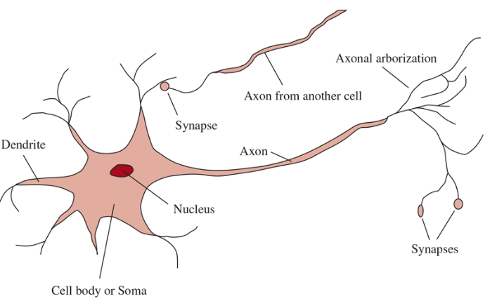

# Introduction to AI

**Chapter 01:**

### What is AI:

Basically the scientist didn't argue on one definition but, we have four categories that we can consider that the AI would be difined in

#### Acting humanly (The Turing test):

The Turing test, proposed by Alan Turing (1950), was designed as a thought experiment that would sidestep the philosophical vagueness of the question “Can a machine think?” A computer passes the test if a human interrogator, after posing some written questions, cannot tell whether the written responses come from a person or from a computer. the computer will need this:

1. **Natural language processing** to communicate successfully in a human language;
2. **knowledge representation** to store what it knows or hears;
3. **automated reasoning** to answer questions and to draw new conclusions;
4. **machine learning** to adapt to new circumstances and to detect and extrapolate patterns.

However other researchers have proposed a total turing test which require interacting with objects and people, that's why they add the following tests:

5. **Computer Vision** and speech recognition to perceive the world
6. **Robotics to manipulate** objects and move about.

### Thinking humanly (The cognite modeling approach):

to say that a program think as a human we must first know how humans think.

1. **introspection—trying** to catch our own thoughts as they go by (For example when an idea come to your mind and then it leads to another one and so on and on, until you feel that you get away from the original idea);
2. **psychological experiments—observing** a person in action;
3. **brain imaging—observing** the brain in action (track the brain movement and compare that with the action of its owner).

- If the program’s input–output behavior matches corresponding human behavior, that is evidence that some of the program’s mechanisms could also be operating in humans. (Like the GPS)

#### Thinking Rationally (The laws of thought):

it all starts with arisotle, His **syllogisms** provided patterns for argument
structures that always yielded correct conclusions when given correct premises

_Example:_ if for all x A(X) -> B(X) then if we have A(tariq) by syllogisms we have B(tariq), But tariq must be in lowercase (Idk why)

#### Acting Rational (The rational agent):

- An **Agent** is an entity that acts (do something)
- A **Computer agent** computer agents are expected to do more: operate autonomously, perceive their environment, persist over a prolonged time period, adapt to change, and create and pursue goals.
- A **Rational agent** is one that acts so as to achieve the best outcome or, when there is uncertainty, the best expected outcome

# The Foundations of Artificial Intelligence

### Philosophy

- Aristotle first formalized the laws of thought, establishing foundations for rational thinking
- Ramon Llull created a mechanical device for generating logical arguments
- Leonardo da Vinci designed (but never built) a mechanical calculator
- Gottfried Wilhelm Leibniz developed a machine to operate on concepts rather than numbers
- Thomas Hobbes proposed that reasoning was essentially computation
- René Descartes contributed significant discussions on mind-body duality
- **Dualism**: The philosophical position that mind and body are distinct entities - mind being nonphysical, body being physical
- **Materialism**: The view that the mind is purely physical, essentially equating it with the brain
- David Hume proposed the principle of induction
- **Induction**: The logical process of deriving general principles from specific instances

### Mathematics

- George Boole developed Boolean algebra, a system for representing logical statements
- Gottlob Frege extended Boolean logic to create first-order logic
- Probability theory emerged as a way to apply logic to uncertain situations
- Statistics developed from the formalization of probability and availability of data
- **Al-Khwarizmi**: Persian mathematician who introduced algorithmic thinking to mathematics

### Economics

- Adam Smith's "The Wealth of Nations" introduced systematic thinking about rational agents and resource allocation

### Neuroscience

- Neuroscience is the study of the nervous system.
  

### Psychology

- Cognitive psychology studies human information processing and decision making

### Computer Engineering

- Development of digital computers enabled practical implementation of AI concepts

### Control Theory and Cybernetics

- Control theory provides frameworks for designing self-regulating systems
- Cybernetics studies control and communication in machines and living things

### Linguistics

- Noam Chomsky's work on generative grammar influenced AI research
