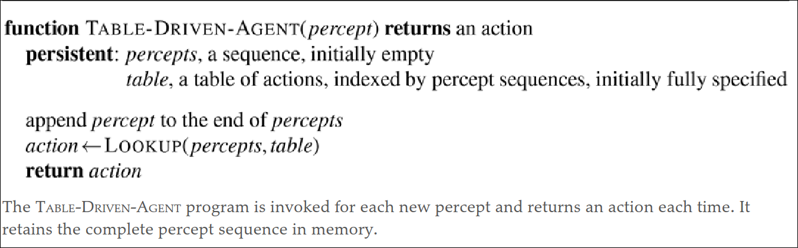
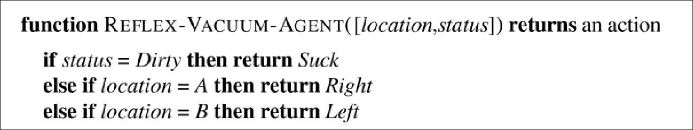
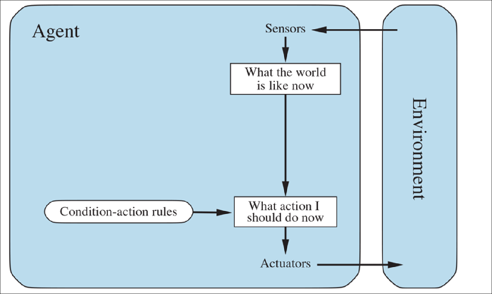
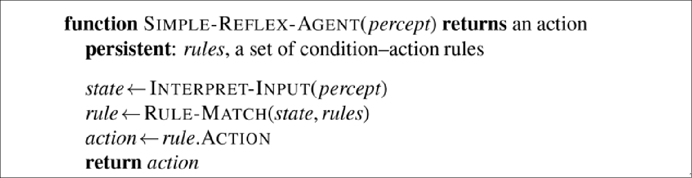
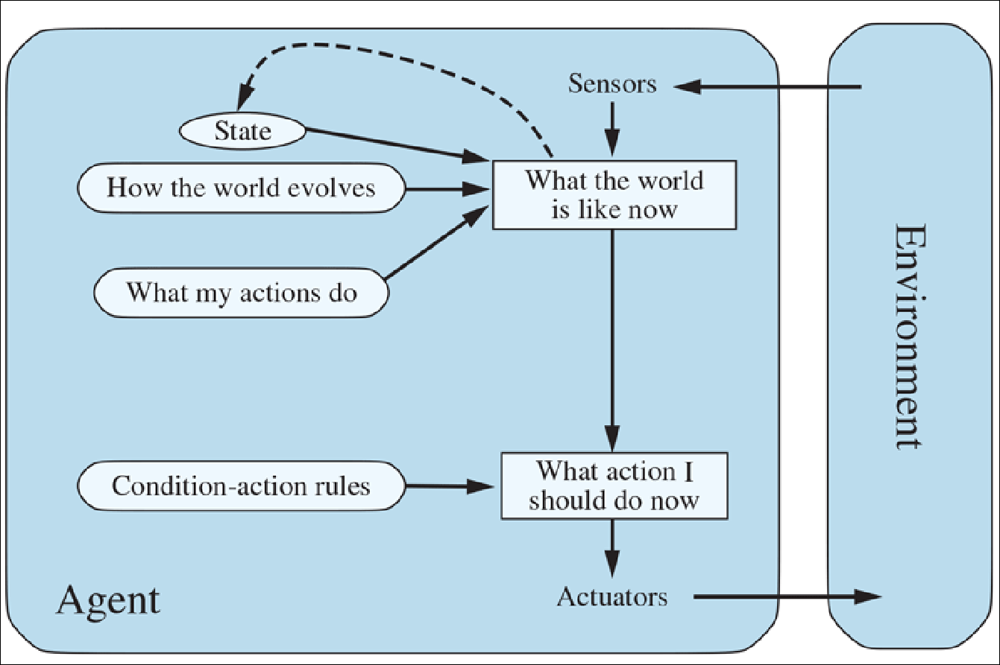
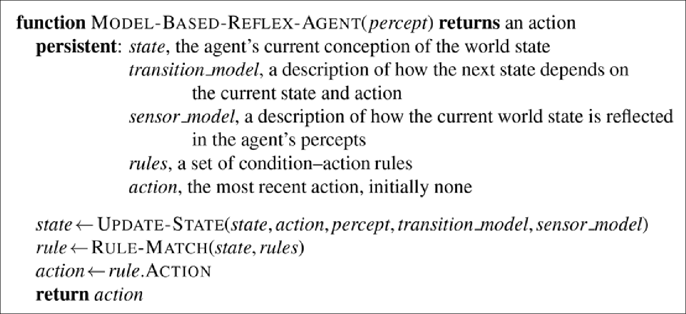
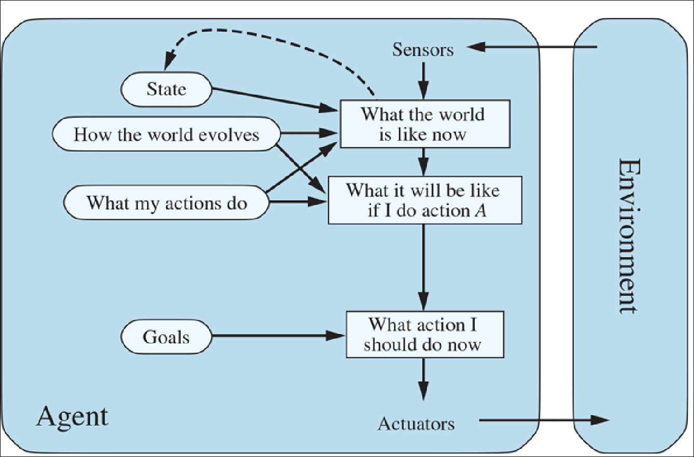
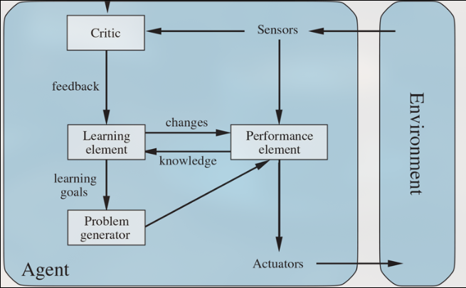

# Intelligent agents:

- an agent is anything that can be viewed as perceiving its environment through sensors and acting upon that environment through actuators
- percept refer to the agent's perceptual inputs at any given instant.
- percept sequence is the complete history of everything the agent has ever perceived.
- agent function maps any given percept sequence to an action.
- agent program is an implementation of the agent function.
- **rational agent** is one that does the right thing.
- performance measure is the criterion that determines how successful an agent is.
- rationality is the performance measure maximization.

### rationality:

It depends on four performance measures:

- The performance measure
- The agent knowledge
- The agent actions
- The agent's percept sequence

### Omniscience, autonomy, and rationality:

- An **omniscient** agent knows the actual outcome of its actions and can act accordingly; but omniscience is impossible in reality.
- **Rationality** maximizes expected performance, while perfection maximizes actual performance
- **autonomy** means that the agent does not depend on the input of humans.

## The nature of environments:

**task environment** is the problems the agents are solutions to.

### Specifying the task environment:

**PEAS** (Performance measure, Environment, Actuators, Sensors) is a way to specify the task environment.

### Properties of task environments:

- **Fully observable vs. partially observable**
  if the agent's sensors give it access to the complete state of the environment at each point in time, then the environment is fully observable.
- **Single-agent vs. multi-agent**
  if the environment contains multiple agents, then it is multi-agent.else it is single-agent.
- **Deterministic vs. stochastic**
  if the next state of the environment is completely determined by the current state and the agent's action, then the environment is deterministic. else it is stochastic.
- **Episodic vs. sequential**
  if the agent's experience is divided into atomic episodes, then the environment is episodic an each episode does'nt depend on the others. else it is sequential.
- **Static vs. dynamic**
  if the environment can change while the agent is deciding on its action, then the environment is dynamic. else it is static.
- **Discrete vs. continuous**
  if there are a limited number of distinct, clearly defined percepts and actions, then the environment is discrete. else it is continuous.
- **Known vs. unknown** if the agent knows the rules of the environment, then the environment is known. else it is unknown.

### The structure of agents:

`agent = architecture + program`

### Agent programs:

it takes the current percept as input and returns an action as output.

#### Simple reflex agents:

The simplest kind of agents, they select actions based only on the current percept, ignoring the rest of the percept history.

**condition action rule**

#### Model based reflex agents:

The agent should maintain some sort of internal state that depends on the percept history and thereby reflects at least some of the unobserved aspects of the current state.

- **The transition model** describes how the environment changes from one state to another in response to an action.
- **The sensor model** describes the perceptual response that an agent would expect to receive in any given state.
  both transition and sensor models form together a model based agent.
  
  

#### Goal-based agents:

The agent needs some sort of goal information that describes situations that are desirable

#### Utility-based agents:

The agent needs a utility function that measures the desirability of states.

**difference between goal-based and utility-based agents:**

- Goal based agents are concerned about achieving the goal without considering whether it is the best choice or not, while utility-based agents are concerned about the best choice to achieve the goal.
  Examples:

1. Recommender systems, the system will aim to recommend something based on teh user preferences and what s/he interested in.
2. Game playing agents

### Learning agents:

The agent learns from the environment and improves its performance over time. A learning agent can be divided into four components:

- **Learning element** is responsible for making improvements.
- **Performance element** is responsible for selecting external actions.
- **Critic** is responsible for giving feedback to the learning element.
- **Problem generator** is responsible for suggesting actions that lead to new and informative experiences.
  

## Summary:

- An agent is something that perceives and acts in an environment.
- The agent function for an agent specifies the action taken by the agent in response to any percept sequence.
- The performance measure evaluates the behavior of the agent in an environment.
- A rational agent acts so as to maximize the expected value of the performance measure,
  given the percept sequence it has seen so far.
- A task environment specification includes the performance measure, the external
  environment, the actuators, and the sensors.
- In designing an agent, the first step must always be to specify the task environment as fully as possible.
- Task environments vary along several significant dimensions. They can be fully or partially observable, single-agent or multi-agent, deterministic or nondeterministic, episodic or sequential, static or dynamic, discrete or continuous, and known or unknown.
- In cases where the performance measure is unknown or hard to specify correctly, there is a significant risk of the agent optimizing the wrong objective. In such cases the agent design should reflect uncertainty about the true objective.
- The agent program implements the agent function.
- There exists a variety of basic agent program designs reflecting the kind of information made explicit and used in the decision process.
- The designs vary in efficiency, compactness, and flexibility.
- The appropriate design of the agent program depends on the nature of the environment.
- Simple reflex agents respond directly to percepts, whereas model-based reflex agents maintain internal state to track aspects of the world that are not evident in the current percept.
- Goal-based agents act to achieve their goals, and utility-based agents try to maximize their own expected “happiness.”
- All agents can improve their performance through learning.
