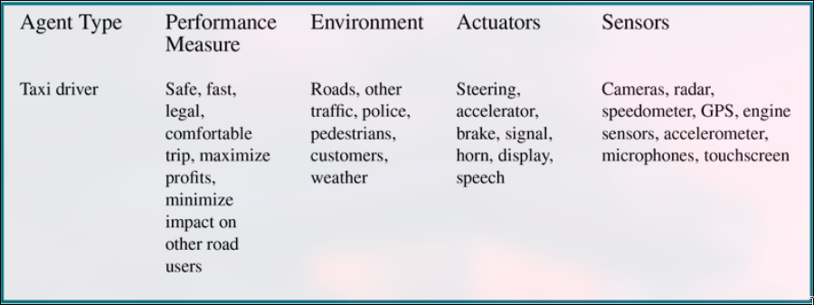

# Intelligent agents:

- an agent is anything that can be viewed as perceiving its environment through sensors and acting upon that environment through actuators
- percept refer to the agent's perceptual inputs at any given instant.
- percept sequence is the complete history of everything the agent has ever perceived.
- agent function maps any given percept sequence to an action.
- agent program is an implementation of the agent function.
- **rational agent** is one that does the right thing.
- performance measure is the criterion that determines how successful an agent is.
- rationality is the performance measure maximization.

### rationality:

It depends on four performance measures:

- The performance measure
- The agent knowledge
- The agent actions
- The agent's percept sequence

### Omniscience, autonomy, and rationality:

- An **omniscient** agent knows the actual outcome of its actions and can act accordingly; but omniscience is impossible in reality.
- **Rationality** maximizes expected performance, while perfection maximizes actual performance
- **autonomy** means that the agent does not depend on the input of humans.

## The nature of environments:

**task environment** is the problems the agents are solutions to.

### Specifying the task environment:

**PEAS** (Performance measure, Environment, Actuators, Sensors) is a way to specify the task environment.

### Properties of task environments:

- **Fully observable vs. partially observable**
  if the agent's sensors give it access to the complete state of the environment at each point in time, then the environment is fully observable.
- **Single-agent vs. multi-agent**
  if the environment contains multiple agents, then it is multi-agent.else it is single-agent.
- **Deterministic vs. stochastic**
  if the next state of the environment is completely determined by the current state and the agent's action, then the environment is deterministic. else it is stochastic.
- **Episodic vs. sequential**
  if the agent's experience is divided into atomic episodes, then the environment is episodic. else it is sequential.
- **Static vs. dynamic**
  if the environment can change while the agent is deciding on its action, then the environment is dynamic. else it is static.
- **Discrete vs. continuous**
  if there are a limited number of distinct, clearly defined percepts and actions, then the environment is discrete. else it is continuous.
- **Known vs. unknown**
  if the agent knows the rules of the environment, then the environment is known. else it is unknown.
