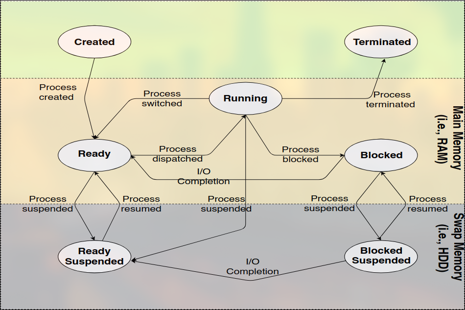
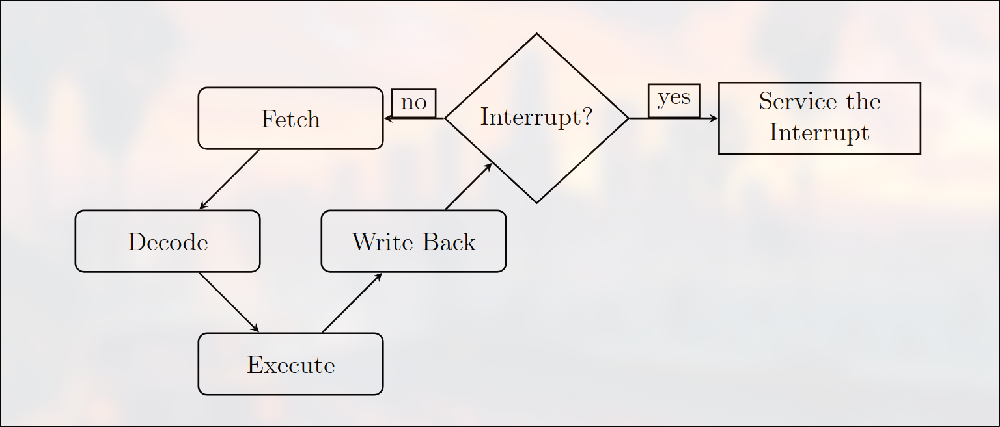

# Process management

**Process** is an instance of a program that is being executed. It consist of the following components:

1. **An address space:** Memory locations where the program’s code, variables, and function frames are stored
2. **The CPU state:** The values of CPU registers (e.g., PC, SP, etc) during the execution of the process (and while it is waiting/blocked)
3. **A set of OS resources:** Representing the physical and the logical resources that the process is using (e.g., open files, network connections, etc)
4. **A lifetime:** Since its creation, a process goes through different phases: created-executed-[interrupted-resumed]-terminated

- A program is a passive entity, whereas a process is its active form.
- The systemd process has the pid of 1 in linux systems.
- Each process that is launched from the terminal has a parent process of the terminal.

## Types of processes:

**System processes** that execute the system code, and **user processes** that execute the user code.

- System processes are executed in kernel mode (master mode — system mode) whereas user processes are executed in user mode (slave mode).

### Terminology:

**Process** Defined ealier (cf., previous slide).
**Task** Could be a process or a thread performing some computation (e.g., printing, downloading, updating, etc). When multiple tasks are executed, that is multitasking — multithreading or multiprocessing. In Java, when a thread is running, it is called a task.
**Job** A complete unit of work. It could be a set of tasks.

## Process states:

- The different states are as follows:
  **New** This state indicates that the process has just been created. for example, in C language the primitive fork() is used to fork (create) a new process.
  **Ready** This state indicates that the process is having all needed resources and is waiting (in the ready queue) for the processor (CPU) to be allocated.
  **Running** Here the process is being executed on the CPU.
  **Blocked** In this state, the process is waiting (in the blocked process queue) for an event to happen. This could be due to an Input/Output operation requested by the process to be performed by the operating system. It can also be that case where the process is waiting for a wake-up signal from another process.
  **Suspended** If a process is suspended, this means that it has been swapped out of RAM for some reason. For example, a process can be suspended to free some space for other process, intentionally suspended by a superuser ([8am-6pm]) to save CPU cycles, swapped out of RAM after being longly waiting for an event to happen, or swapped out by the parent process.
  **Terminated** Here, the process has finished its task and/or has been killed (e.g., in Unix-like operating systems the command kill 2730 is
  used to terminate the process with PID 2730).

On Unix-like operating systems, processes could be in:
• **Running — R** Currently executing on the CPU.
• **Sleeping — S** Waiting for a resource to be available.
• **Stopped — T** Suspended and can be resumed.
• **Idle — I** Idle kernel threads — waiting for a task to be assigned.
• **Zombie — Z** Processes finshed, but father not.
• **Dead — X** Process has terminated (not visible in the list)

## Process Control Block:

The os maintains a data structure for each process called the Process Control Block (PCB). It contains the following information:

- **Process state:** The current state of the process (e.g., running, ready, etc).
- **Program counter:** The address of the next instruction
- **CPU registers:** The values of the CPU registers
- **CPU scheduling information:** The priority of the process, the time it has been waiting, etc.
- **Memory management information:** The memory locations used by the process
- **Accounting information:** The amount of CPU time used, the time limits, etc.
- **I/O status information:** The list of I/O devices used by the process, the list of open files, etc.

## Process creation and termination:

**Creation**. A process can create other processes, called children processes.
• A process executes the fork() system call. Here, the OS duplicates the parent PCB and makes appropriate changes. This includes, assigning the corresponding PID, occupied memory addresses, PC value, etc.
• The parent process can continue its execution or wait (call wait()).
• A process can pass data to another process (e.g., using pipes).
• The address space can either be a duplication of the parent space (same data and code), or a newly loaded program (call execlp()).
• Resources are inherited (e.g., open files, variables, privileges, ...).
**Termination**. Occurs as follows:
• A process executes the exit() system call.
• Running exit() returns an integer to the parent.
• A parent process can terminate a child using kill() system call.

_fork():_ The fork() system call is used to create a new process. The new process created by fork() is called the child process. The process that calls fork() is the parent process. The child process is an exact copy of the parent process except for the following two points:

- The child process has a different process ID.
- The child process has its own copy of the parent’s file descriptors. These file descriptors refer to the same open file descriptions as the corresponding file descriptors in the parent.

* in general if a parent process has n iteration there will be 2^n processes created.

## Concurrent processes:

**Concurrent processes** are processes that are executed simultaneously (e.g., multitasking). This can be achieved using:
• **Multithreading:** Multiple threads are executed in parallel.
• **Multiprocessing:** Multiple processes are executed in parallel.
• **Time-sharing:** The CPU is shared among multiple processes.
**Overlapping**: Real parallelism
**Interleaving**: Fake parallelism
**PPG graph**: A graph that shows the order of execution of processes.

- Processes can run in parallel (or fake-concurrency) and cooperate with
  each other for several reasons:

1. Information sharing: Processes can share information (e.g., using pipes).
2. Computation speedup: Multiple processes can perform computations in parallel.
3. Modularity: Each process can be developed and tested independently.
4. convenience: An individual users may run different processes.

## Interrupts:

Interrupt is an event that alters the sequence of instructions executed by the CPU. A dedicated program called ISR (Interrupt Service Routine) or interrupt handler is executed as a consequence.

- each interrupt has a its own interrupt handler aka ISR (Interrupt Service Routine).
- An ISR is low level program that runs in the kernel mode, it is written in assembly.
- They are located in the interrupt vector table.
- The number of interrupts id generally limited by the architecture.

### Types of interrupts:

There exist two types of interrupts namely:

#### Software based interrupts:

- Exceptions: it happens when the current instruction perform an illegal action like division by zero
- System calls: aka traps it usually happen when a user program request an io operation it issue a system call

#### Hardware Interrupts:

These asynchronous interrupts are triggered by a hardware unit such as the timer/clock, keyboard, mouse, power button,
. . ., device controllers or DMA, to get the attention from the CPU. They can be maskable (MI) or non-maskable (NMI).

**Maskable**: These interrupts the CPU can choose to ignore them based on the current state and the priority like keyboard event, network traffic arrives.
**Non maskable**: The interrupts that the CPU cannot ignore and they demand immediate attention.

- There is also another type of classification as follow:
  **INter processor interrupts**: These interrupts are used to signal other processors in a multiprocessor system. e.g., one processor core requests another processor core to stop when the system is shutting down by the first processor ($shutdown now).
  **Spurious Interrupt**: A.k.a., phantom or ghost interrupt, is an unwanted hardware interrupt, e.g., when an interrupt that has been signaled to the processor and it is no longer required (or interrupt source disappeared), or buggy hardware..
  **Raster interrupt**: This is a type of interrupts used in old monitors. It was employed to synchronize the display with the CPU’s processing speed. In these monitors, the electron beam that traced the screen’s pixels moved horizontally across the screen, line by line. A raster interrupt was generated at the end of each line, signaling the CPU that it could update the video memory with the next line’s data.

* We call an interrupt storm the event where the operating system receives a large number of interrupts (from hardware) that consumes the majority of the processor’s time spurious signals, interrupt handler execution took too long, . . ., faulty drivers. The system becomes non-responsive.

#### System calls:

System calls Constitutes an interface between the user (programs) and the services that are made available by an operating system. They constitute a programmatic way in which a computer program requests a service from the operating system (e.g., reading from a file, writing to a file, creating a new process, allocating memory, free memory, sending packets through the network interface, sending a signal to another process, etc). Each operating system has its own system calls (e.g., GNU/Linux has 300, FreeBSD has 500, and Windows 7 has 700).

- System calls can be grouped into six main categories:
  **Process Control** These are system calls for managing processes. They include calls to end, abort, load, execute, create, and terminate processes.
  **File Management** These are system calls for managing files. They include calls to create, delete, open, close, read, write, and reposition files.
  **Device manipulation** These are system calls for managing devices. They include calls to request, release, read, write, and reposition devices (like network interfaces, printers, etc).
  **Information maintenance** These are system calls for managing information. They include calls to get and set time, date, and system data.
  **Communication** These are system calls for inter-process communication. They include calls to create, delete a network connection, send and receive messages, and transfer status information. They include syscalls such as pipe(), mmap(), shm open(), and gethostid().
  **Protection** These are system calls for managing protection. They include calls to control access to resources, and to grant and revoke access rights.

#### Hardware interrupts and polling:

**Polling** Each time the CPU check each device if new information is available.
**Interrupts** Here the device send a signal to the interrupt controller to request attention, The Cpu preempts running process to handle device request

- The period of time from the arrival of an interrupt at the CPU to the start of the routine that services the interrupt is called the interrupt latency.
- After each (user mode) instruction is executed, the CPU checks whether the interrupt controller has any interrupt pending. If an interrupt is there, the current process is “interrupted”, and the appropriate handler is executed.
- Hence, after each instruction execution cycle, the processor check a flag “interrupt flag” in the FLAGS register to determine whether there is (or there are) any interrupt(s) pending. If the flag is set to 1, then at least one hardware interrupt is pending, and has to be serviced. To that end, the currently running process is interrupted and the corresponding interrupt service routine is invoked
  

### Context-Switching

During a process turnaround time (lifetime), the process may obtain the CPU for a while to execute some of its code, lose it for a while, then get it back to continue its execution till it terminates. Each time the process is interrupted to give the CPU to another process to execute, and then resumed to continue executing.
