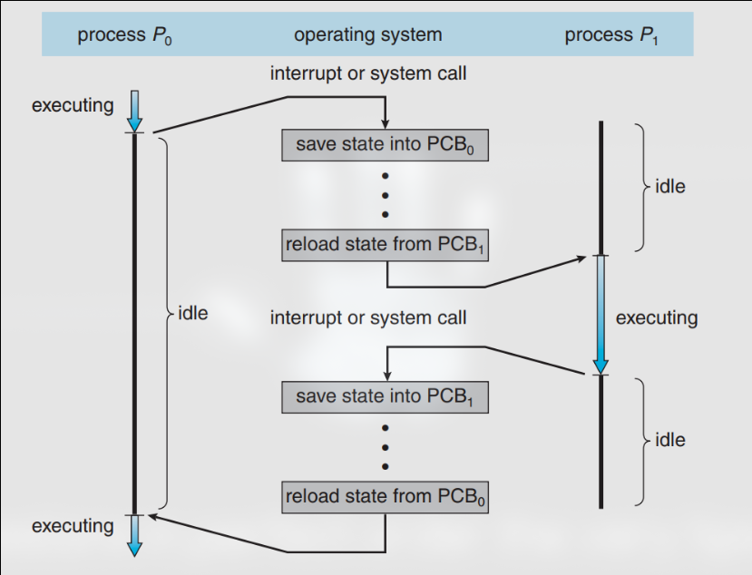

# Context-Switching

is the mechanism that allows the kernel (Operating system) to :

1. Save the context of the current process into its PCB (so that the system doesn't lose track of the process)
2. Load the context of the next process from its PCB (so that the system can start executing the next process)

This mechanism allows the following:

1. it increases the CPU throughput (number of processes executed at a time)
2. increases the cpu response time
3. prevents some processes from hogging on the CPU for a long time
4. it allows high priority processes to be executed first

## Interrupts with context switching

Assuming that the process P1 is executing and a process P2 is in the next ready queue (this is the queue of the PCBs of processes that are ready to be executed) then if an interrupt occurs:

1. The CPU will pushes the current PC onto the stack (of the interrupted process, here P1) and updates the PC-register to contain the address (obtained from the Interrupt Controller) of the 1st instruction in the corresponding interrupt handler (interrupt service routine).
2. The interrupt handler (aka. ISR) starts execution:

- it pushes all remaining registers onto the stack then performs its task (eg display error message, update clock, move mouse...)
- it invokes an operating system module, called the scheduler, to cause a context switch if required. if that os the case, the scheduler will:
  - Copies all registers values from the stack of the process (P1) into PCB1 (process control block of process P1).
  - Moves PCB1 to end of ready/blocked queue, and PCB2 into the head. PCB1 is moved to the ready queue if the scheduler determined that it was the time to interrupt P1 and deallocate the CPU and select another (P2) to be allocated the CPU. If PCB1 is moved to the blocked queue, then that should be a consequence of system call made by process P1 (e.g., P1 requested an I/O operation). That results in an interrupt and the corresponding routine is invoked.
  - Copies registers values from PCB2 into CPU-registers, except the PC values which get copied to the top of the new stack (P2’s stack) so that P2 an execute.
- The interrupt routine executes RTI (ReTurn from Interrupt) to indicate its termination. This causes the CPU to automatically pop the PC value from the new stack to CPU’s PC register.

3. The CPU then, starts/resumes the execution of process P2.

## Interrupts without Context-Switching
