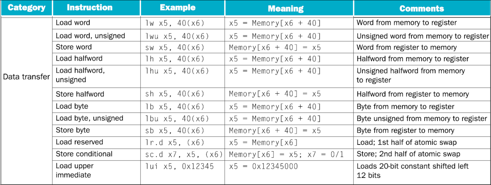
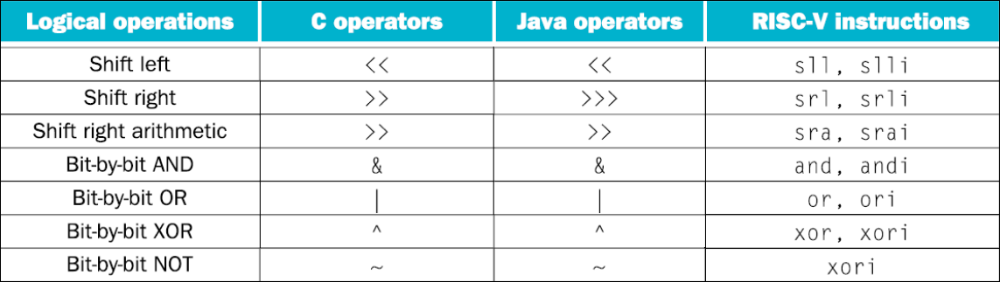
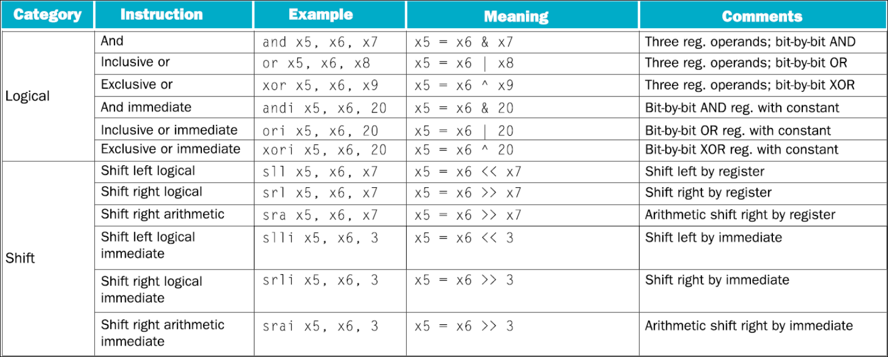

# Risc V instruction set

## From high level languages to machine code

- **Assembly language** is a language closer to machine code than high level languages. It is a low level language that is easier to read and write than machine code. It is a one-to-one mapping to machine code. Assembly language is specific to a particular computer architecture.
- **Assembler** is a program that translates assembly language to machine code.
- **Instruction Set:** The vocabulary of commands understood by a given CPU. It is the set of instructions that a particular CPU can execute.
- Risk V is open architecture that is controlled by RISC-V international. It is a free and open instruction set architecture (ISA) based on established reduced instruction set computing (RISC) principles.

### Arithmetic operations:

Addition, subtraction, multiplication, division, etc.

- The natural number of operands is three.
- Requiring every instruction to have exactly three operands, no more and no less, conforms to the philosophy of keeping the hardware simple.
- hardware for a variable number of operands is more complicated than hardware for a fixed number.

### Register/Memory operations:

- the operands of RISC-V arithmetic instructions must be from a limited number of registers.
- RISC-V has 32 registers, each 32 bits wide.
- A double word is 64 bits wide.
- The reason for the limit of 32 registers is that very large number of registers may increase the clock cycle time simply because it takes electronic signals longer when they must travel farther (Design Principle 2: Smaller is faster).
  Example of registers:
- x0: the constant value 0
- x1: return address
- x2: stack pointer
- x3: global pointer
- x4: thread pointer
- x5 – x7, x28 – x31: temporaries
- x8: frame pointer
- x9, x18 – x27: saved registers
- x10 – x11: function arguments/results
- x12 – x17: function arguments
  **Data transfer instructions** are used to move data between memory and registers.

### Data transfer operations:

- Load: move data from memory to register, the real name of this instruction is lw.
- Store: move data from register to memory, the real name of this instruction is sw.
  

### Logical operations:



#### **Comparison of Shift Instructions in RISC-V (`SRAI`, `SRLI`, `SLLI`)**

RISC-V provides three types of **immediate shift** instructions:

| Instruction                                 | Type                   | Effect                   | Sign Extension? |
| ------------------------------------------- | ---------------------- | ------------------------ | --------------- |
| **SRAI** (Shift Right Arithmetic Immediate) | Arithmetic Right Shift | Preserves sign bit (MSB) | **Yes**         |
| **SRLI** (Shift Right Logical Immediate)    | Logical Right Shift    | Fills with `0`s          | **No**          |
| **SLLI** (Shift Left Logical Immediate)     | Logical Left Shift     | Fills with `0`s          | **No**          |

---

#### **1. SRAI (Shift Right Arithmetic Immediate)**

- Shifts bits **right** while **preserving the sign bit**.
- If the number is **negative**, it maintains the `1`s in the upper bits.

**Example (SRAI)**

```assembly
addi x5, x0, -8     # x5 = -8 (0xFFFFFFF8 in 32-bit)
srai x6, x5, 2      # x6 = -2 (0xFFFFFFFE)
```

Binary:

```
x5 =  1111 1111 1111 1111 1111 1111 1111 1000  (-8)
SRAI 2 →  1111 1111 1111 1111 1111 1111 1111 1110  (-2)
```

---

#### **2. SRLI (Shift Right Logical Immediate)**

- Shifts bits **right** and fills with `0`s in the upper bits.
- Used for unsigned numbers.

**Example (SRLI)**

```assembly
addi x5, x0, -8     # x5 = -8 (0xFFFFFFF8 in 32-bit)
srli x6, x5, 2      # x6 = 1073741822 (0x3FFFFFFE)
```

Binary:

```
x5 =  1111 1111 1111 1111 1111 1111 1111 1000  (-8)
SRLI 2 →  0011 1111 1111 1111 1111 1111 1111 1110  (1073741822)
```

- **Sign bit (MSB) is lost**, making it a positive number.

---

#### **3. SLLI (Shift Left Logical Immediate)**

- Shifts bits **left** and fills with `0`s.
- Used for **multiplying** by powers of 2.

**Example (SLLI)**

```assembly
addi x5, x0, 7      # x5 = 7 (0x00000007)
slli x6, x5, 2      # x6 = 28 (0x0000001C)
```

Binary:

```
x5 =  0000 0000 0000 0000 0000 0000 0000 0111  (7)
SLLI 2 →  0000 0000 0000 0000 0000 0000 0001 1100  (28)
```

- Effectively **multiplies** by \( 2^2 = 4 \).

---

#### **Summary**

| Instruction | Operation        | Example (`x5 = -8`) | Result (`x6`)             |
| ----------- | ---------------- | ------------------- | ------------------------- |
| **SRAI**    | Arithmetic Right | `srai x6, x5, 2`    | `-2` (0xFFFFFFFE)         |
| **SRLI**    | Logical Right    | `srli x6, x5, 2`    | `1073741822` (0x3FFFFFFE) |
| **SLLI**    | Logical Left     | `slli x6, x5, 2`    | `-32` (0xFFFFFFE0)        |



### Conditional operations:

The Risc v assembly language includes two decision making instructions:

1. `beq` (Branch if Equal)
2. `bne` (Branch if Not Equal)

Examples:

```assembly
beq x1, x2, 100 # branch to 100 if x1 == x2
bne x1, x2, 100 # branch to 100 if x1 != x2
```

**Loops**:

```c++
for (int i = 0; i < 10; i++) {
    // loop body
}
```

```assembly
addi x10, x0, 0 # i = 0
loop:
    bge x10, 10, end # if i >= 10, exit loop
    # loop body
    addi x10, x10, 1 # i++
    j loop # jump to loop
end:
```

**Basic blocks:** a basic block is a sequence of instructions without a branches, except at the end.

**branch if less than (blt)** instruction compares the values in registers rs1 and rs2 and takes the branch if the value in rs1 is less than the value in rs2.
**branch if greater than or equal (bge)** instruction compares the values in registers rs1 and rs2 and takes the branch if the value in rs1 is greater than or equal to the value in rs2.
**branch if less than,unsigned** (bltu) instruction compares the values in registers rs1 and rs2 and takes the branch if the value in rs1 is less than the value in rs2.
**branch if greater than or equal, unsigned** (bgeu) instruction compares the values in registers rs1 and rs2 and takes the branch if the value in rs1 is greater than or equal to the value in rs2.
